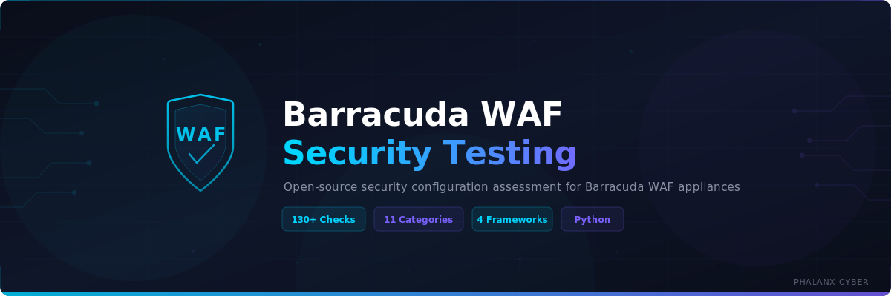

<p align="center">
  
</p>

<p align="center">
  <strong>Open-source Python-based security configuration assessment for Barracuda WAF appliances</strong>
</p>

<p align="center">
  <a href="#security-check-categories"></a>
  <a href="#security-check-categories"></a>
  <a href="#compliance-mapping"></a>
  <a href="LICENSE"></a>
  
</p>

---

## Overview

Connects to the **Barracuda WAF REST API** (read-only) and audits **180+ security checks** across 16 categories — WAF policies, SSL/TLS, access controls, authentication, services, network, DDoS protection, bot protection, API security, logging, and firmware. Generates interactive HTML and JSON reports with posture scoring, severity dashboards, and compliance mapping.

### Key Capabilities

- **180+ security checks** across 16 categories with actionable remediation guidance
- **Read-only assessment** — GET requests only, never modifies WAF configuration
- **Posture scoring** — 0–100 score with letter grades (A–F) based on weighted severity
- **Compliance mapping** — CIS Barracuda WAF Benchmark, OWASP Top 10 2021, PCI DSS v4.0, NIST CSF 2.0
- **Interactive HTML reports** — Self-contained dark-theme report with severity filters, search, and category charts
- **Selective scanning** — Run specific check categories or use YAML scan profiles
- **CI/CD integration** — Exit codes based on severity (0=clean, 1=HIGH, 2=CRITICAL)
- **Token-based auth** — Automatic session management with retry logic and token refresh

---

## Security Check Categories

| Category | Checks | Focus Areas |
|----------|-------:|-------------|
| **WAF Policies** | 25 | Attack actions, request limits, cookie security, parameter protection, URL normalization, data theft prevention, JSON/XML security |
| **SSL/TLS** | 15 | TLS 1.2+, cipher suites, PFS, HSTS, certificate expiry, OCSP stapling, key size, signature algorithm |
| **Access Control** | 15 | IP ACLs, geo-blocking, rate limiting, brute-force prevention, IP reputation, URL access rules |
| **Authentication** | 12 | Admin MFA, password policy, session timeout, LDAP/SAML security, RBAC, account lockout |
| **Services** | 12 | Backend SSL, health checks, security policy assignment, HTTP exposure, server headers, error pages |
| **Network** | 10 | Management access, HA clustering, VLAN segmentation, SNMP v3, NTP, Telnet detection |
| **DDoS Protection** | 10 | Slow client (Slowloris), connection limits, SYN flood, HTTP flood, request rate limiting |
| **Bot Protection** | 8 | Bot mitigation, CAPTCHA, client fingerprinting, JS challenge, signature blocking, web scraping |
| **API Security** | 8 | JSON/XML validation, content-type enforcement, CORS, payload limits, GraphQL, API discovery |
| **Logging & Monitoring** | 10 | Syslog forwarding, SIEM integration (CEF/LEEF), WAF logging, audit logs, alerting |
| **Firmware & Updates** | 5 | Firmware version, EOL status, Energize subscription, auto-updates, attack definitions |
| **Content Rules** | 11 | URL rewriting, open redirects, response headers, CSP, X-Frame-Options, HSTS, Referrer-Policy |
| **Adaptive Profiling** | 10 | Learning mode, URL/parameter profiles, positive security model, trusted host learning |
| **Backup & Recovery** | 9 | Scheduled backups, encryption, offsite/cloud backup, HA config sync, FTP/SCP transfer |
| **License & Capacity** | 10 | License status, throughput utilization, ATP, feature modules, SSL TPS capacity |
| **CVE Assessment** | 12 | Known CVE matching against firmware, version gap analysis, vulnerability definition updates |

---

## Quick Start

### Prerequisites

- Python 3.9+
- Network access to Barracuda WAF REST API (default port 8443)
- Admin credentials with read access (see below)

### Prerequisites & Permissions

The scanner requires **admin-level read access** to the Barracuda WAF REST API to perform a comprehensive assessment. Without admin privileges, approximately 60–70% of checks will return incomplete results.

**API endpoints requiring admin access:**

| Endpoint | Check Categories | Impact Without Access |
|----------|-----------------|----------------------|
| `/admin` | Authentication, Network | Password policy, MFA, SNMP, SSH/Telnet, session timeout — all skipped |
| `/system` | Firmware, CVE, License | Firmware version, EOL, subscriptions, CVE matching — all skipped |
| `/cluster` | Network, Backup | HA configuration and config sync checks skipped |
| `/backup` | Backup & Recovery | Backup schedule, encryption, offsite DR checks skipped |
| `/syslog` | Logging & Monitoring | Syslog, WAF logging, audit log, SIEM integration checks skipped |
| `/security-policies` | WAF Policies, API Security | Full policy details including parameter protection, cookie security, JSON/XML rules |
| `/services` | Services, SSL, DDoS, Bot | Virtual services, backend SSL, health checks, bot protection |
| `/signed-certificate` | SSL/TLS | Certificate expiry, key size, signature algorithm |

**Recommended setup for production scanning:**

1. **Create a dedicated scan account** — Do not use the primary admin account. Create a separate read-only admin user specifically for automated scanning
2. **Restrict by source IP** — Limit the scan account's management access to the scanner host's IP address only
3. **Enable MFA** — Apply multi-factor authentication to the scan account where supported
4. **Use strong credentials** — Minimum 16-character password with complexity requirements
5. **Rotate after assessment** — Change the scan account password after each assessment cycle
6. **Audit trail** — Ensure admin audit logging is enabled to track all scanner API calls
7. **Read-only operation** — The scanner only performs GET requests (plus POST for login and DELETE for logout). No WAF configuration is ever modified

> **Note:** If your Barracuda WAF firmware supports Role-Based Access Control (RBAC), a read-only admin role is sufficient for all scanner checks.

### Installation

```bash
git clone https://github.com/Krishcalin/Barracuda-WAF-Security-Testing.git
cd Barracuda-WAF-Security-Testing
pip install -r requirements.txt
```

### Usage

```bash
# Full scan with HTML + JSON reports
python barracuda_waf_scanner.py --host 192.168.1.100 --user admin --password MyP@ss \
  --html report.html --json report.json

# Scan specific categories only
python barracuda_waf_scanner.py --host 192.168.1.100 --user admin --password MyP@ss \
  --checks ssl_tls,waf_policies,access_control

# Use YAML scan profile
python barracuda_waf_scanner.py --host 192.168.1.100 --user admin --password MyP@ss \
  --profile config/default_profile.yaml

# Skip SSL verification (lab / self-signed certs)
python barracuda_waf_scanner.py --host 192.168.1.100 --user admin --password MyP@ss --insecure

# Verbose output for debugging
python barracuda_waf_scanner.py --host 192.168.1.100 --user admin --password MyP@ss -v
```

---

## CLI Reference

| Option | Description | Default |
|--------|-------------|---------|
| `--host` | Barracuda WAF IP or hostname | *required* |
| `--port` | REST API port | `8443` |
| `--user` | Admin username | `admin` |
| `--password` | Admin password | *required* |
| `--insecure` | Skip SSL certificate verification | `false` |
| `--timeout` | API request timeout (seconds) | `30` |
| `--checks` | Comma-separated check categories | all |
| `--profile` | Path to YAML scan profile | none |
| `--html` | HTML report output path | none |
| `--json` | JSON report output path | none |
| `-v, --verbose` | Enable debug logging | `false` |
| `-q, --quiet` | Suppress banner and summary | `false` |

### Available Check Categories

`waf_policies` · `ssl_tls` · `access_control` · `authentication` · `services` · `network` · `ddos_protection` · `bot_protection` · `api_security` · `logging_monitoring` · `firmware_updates` · `content_rules` · `adaptive_profiling` · `backup_recovery` · `license_capacity` · `cve_checks`

---

## Report Output

### HTML Report

Self-contained dark-theme HTML report with:
- **Severity dashboard** — Clickable filter cards for CRITICAL / HIGH / MEDIUM / LOW / INFO
- **Posture score** — Ring gauge with 0–100 score and letter grade (A–F)
- **Category chart** — Horizontal bar chart of findings by category
- **Interactive findings** — Expandable accordions with resource, actual/expected values, and remediation
- **Search & filters** — Real-time text search + severity/category dropdown filters

### JSON Report

Structured JSON output with scan metadata, severity counts, posture score, and full findings array — suitable for SIEM ingestion, CI/CD pipelines, and custom dashboards.

### Posture Score Formula

```
Score = 100 - (CRITICAL × 15 + HIGH × 5 + MEDIUM × 2 + LOW × 0.5)
```

| Grade | Score Range |
|-------|-------------|
| A | 90–100 |
| B | 80–89 |
| C | 70–79 |
| D | 60–69 |
| F | 0–59 |

---

## Compliance Mapping

Each finding is mapped to relevant controls across four frameworks:

| Framework | Version | Examples |
|-----------|---------|----------|
| **CIS Barracuda WAF Benchmark** | 1.0 | Section 2–11 controls |
| **OWASP Top 10** | 2021 | A01–A10 (Broken Access Control, Cryptographic Failures, Injection, etc.) |
| **PCI DSS** | 4.0 | Requirements 1, 2, 4, 6, 8, 10 |
| **NIST CSF** | 2.0 | PR.AC, PR.DS, PR.PT, DE.AE, ID.RA |

Mappings are defined in `config/compliance_maps.yaml` and can be extended for additional frameworks.

---

## Scan Profiles

YAML-based profiles allow enabling/disabling specific check categories:

```yaml
# config/default_profile.yaml
scan_profile:
  name: "Full Security Audit"

checks:
  waf_policies: true
  ssl_tls: true
  access_control: true
  authentication: true
  services: true
  network: true
  ddos_protection: true
  bot_protection: true
  api_security: true
  logging_monitoring: true
  firmware_updates: true
```

Create custom profiles for targeted assessments (e.g., `ssl_only.yaml` with only `ssl_tls: true`).

---

## Running Tests

```bash
# Run all 48 unit tests
python -m unittest tests.test_scanner -v

# Or with pytest
python -m pytest tests/ -v
```

Tests use mock API responses (`tests/test_data/mock_responses.json`) — no live WAF connection required.

---

## Repository Structure

```
barracuda_waf_scanner.py          # Main CLI entry point
checks/                           # Security check modules (16 modules)
├── waf_policies.py               #   WAF policy configuration (25 checks)
├── ssl_tls.py                    #   SSL/TLS and certificates (15 checks)
├── access_control.py             #   IP ACLs, rate limiting, brute-force (15 checks)
├── authentication.py             #   Admin auth, MFA, password policy (12 checks)
├── services.py                   #   Virtual service configuration (12 checks)
├── network.py                    #   Network, HA, SNMP, management (10 checks)
├── ddos_protection.py            #   DDoS and flood protection (10 checks)
├── bot_protection.py             #   Bot mitigation, CAPTCHA (8 checks)
├── api_security.py               #   JSON/XML, CORS, API limits (8 checks)
├── logging_monitoring.py         #   Syslog, SIEM, audit, alerts (10 checks)
├── firmware_updates.py           #   Firmware, EOL, subscriptions (5 checks)
├── content_rules.py              #   URL rewriting, response headers, CSP (11 checks)
├── adaptive_profiling.py         #   Learning mode, URL/parameter profiles (10 checks)
├── backup_recovery.py            #   Backups, encryption, DR, HA sync (9 checks)
├── license_capacity.py           #   License, throughput, ATP, features (10 checks)
└── cve_checks.py                 #   Known CVE matching, version analysis (12 checks)
utils/
├── api_client.py                 # Barracuda WAF REST API client (token auth, retry)
├── report_generator.py           # HTML + JSON report generation
└── severity.py                   # Severity scoring and grading
config/
├── default_profile.yaml          # Default scan profile (all checks enabled)
└── compliance_maps.yaml          # CIS / OWASP / PCI DSS / NIST CSF mappings
tests/
├── test_data/mock_responses.json # Mock API responses for offline testing
└── test_scanner.py               # 48 unit tests for all 16 check modules
assets/
└── banner.svg                    # Repository banner
reports/                          # Generated scan reports (gitignored)
requirements.txt                  # Python dependencies
CLAUDE.md                         # AI assistant context
README.md
LICENSE                           # MIT
```

---

## Exit Codes

| Code | Meaning | Use Case |
|------|---------|----------|
| `0` | No HIGH or CRITICAL findings | CI/CD pipeline passes |
| `1` | HIGH severity findings detected | Pipeline warning |
| `2` | CRITICAL severity findings detected | Pipeline failure |

---

## Architecture

```
┌─────────────────┐     REST API (HTTPS)     ┌─────────────────────┐
│  Scanner CLI     │ ◄──────────────────────► │  Barracuda WAF      │
│                  │     GET requests only     │  REST API v3.2      │
│  ┌────────────┐  │                          │  Port 8443          │
│  │ 11 Check   │  │                          └─────────────────────┘
│  │ Modules    │  │
│  └─────┬──────┘  │
│        │         │
│  ┌─────▼──────┐  │
│  │ Severity   │  │     ┌─────────────────┐
│  │ Scoring    │  │────►│ HTML Report      │
│  └─────┬──────┘  │     │ JSON Report      │
│        │         │     │ Console Summary   │
│  ┌─────▼──────┐  │     └─────────────────┘
│  │ Compliance │  │
│  │ Mapping    │  │
│  └────────────┘  │
└─────────────────┘
```

---

## Contributing

1. Fork the repository
2. Create a feature branch (`git checkout -b feature/new-check`)
3. Add checks following the existing module pattern in `checks/`
4. Include unit tests with mock API responses
5. Submit a pull request

---

## License

MIT — see [LICENSE](LICENSE) for details.
